<!--
---
title: Evolution of tissue-specific expression of ancestral genes across vertebrates and insects
output:
  html_document: default
  pdf_document: default
---
-->

# Evolution of tissue-specific expression of ancestral genes across vertebrates and insects

<!--   -->

<figure>
  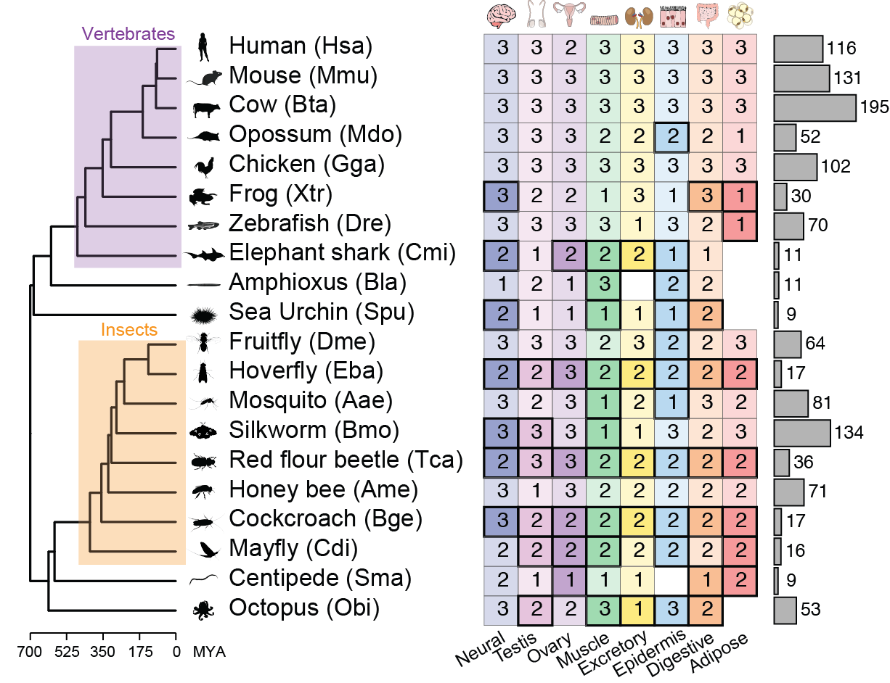
  <figcaption><b>RNA-seq dataset overview.</b> Left: phylogenetic tree including the common names and scientific acronyms of the 20 bilaterian species considered in this study. Evolutionary distances were derived from 75 (MYA: million years ago) and animal silhouettes downloaded from http://phylopic.org/. Center: scheme of RNA-seq meta-samples. The number of meta-samples for each species (rows) and tissue (columns) is reported. The cell color corresponds to the tissue, while its intensity distinguishes between cases where at least one RNA-seq sample has been generated for this project (full color) from cases where all the included samples are publicly available (transparent color). Right: barplot with the total number of processed RNA sequencing (RNA-seq) samples per species.</figcaption>
<figure>

<!--   -->

Content overview
-------

This is a github repository containing the code used to generate the results and figures associated with the final version of the following publication: [Mantica et al, biorxive, 2022](https://www.biorxiv.org/content/10.1101/2022.11.14.516384v1). 

Table of contents
-------
* [Analysis](#analysis)  
  + [Preliminary annotation fixes](#preliminary-annotation-fixes)  
  + [Gene orthologies and sets](#gene-orthologies-and-sets)  
  + [Gene expression preprocessing](#gene-expression-preprocessing)  
  + [Gene expression quantification](#gene-expression-quantification)    
  + [GO transfers](#go-transfers)  
  + [Bilaterian ancestral modules](#bilaterian-ancestral-modules)  
  + [Bilaterian ancestral motif analyses](#bilaterian-ancestral-motif-analysis)
  + [Tissue-specificity call](#tissue-specificity-call)  
  + [Tissue-specificity inferences](#tissue-specificity-inferences)  
  + [Supplementary analysis](#supplementary-analysis)
* [Figures](#figures)  
  + [Main Figures](#main-figures)  
    - [Figure 1](#figure-1)  
    - [Figure 2](#figure-2)  
    - [Figure 3](#figure-3)  
    - [Figure 4](#figure-4)  
    - [Figure 5](#figure-5)  
  + [Extended Data Figures](#extended-data-figures)  
    - [Extended Data Figure 1](#extended-data-figure-1)  
    - [Extended Data Figure 2](#extended-data-figure-2)  
    - [Extended Data Figure 3](#extended-data-figure-3)  
    - [Extended Data Figure 4](#extended-data-figure-4)  
    - [Extended Data Figure 5](#extended-data-figure-5)  
    - [Extended Data Figure 6](#extended-data-figure-6)  
    - [Extended Data Figure 7](#extended-data-figure-7)  
    - [Extended Data Figure 8](#extended-data-figure-8)  
    - [Extended Data Figure 9](#extended-data-figure-9)  
    - [Extended Data Figure 10](#extended-data-figure-10)  
  + [Supplementary figures](#supplementary-figures)
    - [Supplementary Figure 1](#supplementary-figure-1)  
    - [Supplementary Figure 2](#supplementary-figure-2)  
    - [Supplementary Figure 3](#supplementary-figure-3)  
    - [Supplementary Figure 4](#supplementary-figure-4)  
  

Analysis
------------

### Preliminary annotation fixes  
This folder contains a snakemake pipeline (i.e., **Snakefile**) used to fix annotation errors, together with the relative configuration file (**config.yml**) and a file with the parameters needed for cluster job submission (**cluster.json**). All relevant scripts can be found in the **bin** subfolder. The Snakefile includes rules to:  

* Generate protein fasta files for all species starting from the original annotation (best protein isoform per gene only).    
* Perform a preliminary gene orthology run with [Broccoli](https://academic.oup.com/mbe/article/37/11/3389/5865275), which will be used to identify problematic gene annotations.   
* Identify and fix broken genes.   
* Identify and fix chimeric genes.   
* Generate new gene annotations for all species, which include the corrections performed on broken and chimeric genes.  
* Run [BUSCO](https://busco.ezlab.org/) to evaluate the quality of the new gene annotations.  
* Correct the existing gene orthologies including the changes introduced for the broken/chimeric genes.  
* Merge the gene orthogroups based on known human onhologs.  

### Gene orthologies and sets  
This folder contains a snakemake pipeline (i.e., **Snakefile**) used to generate the different sets of orthogroups used throughout the paper. The folder also contains the relative configuration file (**config.yml**) and a file with the parameters needed for cluster job submission (**cluster.json**). All relevant scripts can be found in the **bin** subfolder. The Snakefile includes rules to:  

* Filter the original orthogroups based on the total number of genes and proportions per species.  
* Filter the original orthogroups based on the minimum expression.  
* Isolate bilaterian, vertebrate and insect conserved genes. Only bilaterian-conserved genes have been used for the analysis included in this paper.  
* Compute pairwise sequence similarities and pearson expression correlations between all possible pairs of genes (from different species) within an orthogroup. These values will be used to select the best-ancestral orthologs.  
* Select the best-ancestral orthologs for each species within the bilaterian-conserved orthogroups.  

### Gene expression preprocessing  
This folder contains a snakemake pipeline (i.e., **Snakefile**) used to generate gene expression quantification at the sample level starting from the fastq files (both for the public available and in-house generated data). The folder also contains the relative configuration file (**config.yml**) and a file with the parameters needed for cluster job submission (**cluster.json**). All relevant scripts can be found in the **bin** subfolder. The Snakefile includes rules to:  

* Download the public available fastq files.  
* Run quality control on all fastqs (public available and in-house).  
* Get the transcriptome index fasta needed for quantification of gene expression by [Kallisto](https://pachterlab.github.io/kallisto/about).    
* Quantify counts at the transcript level through [Kallisto](https://pachterlab.github.io/kallisto/about) for all the samples.  
* Merge counts at the gene level. 
* Normalize raw counts with [DESeq2](https://bioconductor.org/packages/release/bioc/html/DESeq2.html). 
* Generate gene expression quantification in logged (log2) and unlogged TPMs or RPKMs, using as input the DESeq2 normalized counts. Only the logged TPM quantification has been considered for the final results presented in the paper.  

### Gene expression quantification  
This folder contains a snakemake pipeline (i.e., **Snakefile**) used to generate gene expression quantification at the sample, meta-sample and tissue level starting from normalized counts across species. The folder also contains the relative configuration file (**config.yml**) and a file with the parameters needed for cluster job submission (**cluster.json**). All relevant scripts can be found in the **bin** subfolder. The Snakefile includes rules to:  

* For each species, quantify gene expression at the meta-sample level; this is represented by the median expression across all samples included in a given meta-sample.    
* For each species, quantify gene expression at the tissue level; this is represented by the average expression across all meta-samples of a given tissue.  
* Generate gene expression matrices for the best-ancestral orthogroups (see [Gene orthologies and sets](#gene-orthologies-and-sets)) with orthogroup IDs on row, metasamples/tissues from all species on columns, and expression of the relative best-ancestral orthogroup as value.  
* Quantile-normalize the best-ancestral orthogroup gene expression matrices.  
* For each species, perform an SVA normalization across samples (from [Fukushima et al, NatCom, 2020](https://www.nature.com/articles/s41467-020-18090-8)). This normalization was used for one of the controls showed in supplementary figure **XXX**.

### GO transfers  
This folder contains a snakemake pipeline (i.e., **Snakefile**) used to generate GO annotations at the orthogroup level starting from the annotation of selected reference species (e.g., human and drosophila). The folder also contains the relative configuration file (**config.yml**) and a file with the parameters needed for cluster job submission (**cluster.json**). All relevant scripts can be found in the **bin** subfolder. The Snakefile includes rules to:  

* Generate annotations at the orthogroup level, both in text and gmt format. These will be used for GO enrichments throughout the paper.  
* Generate backgrounds to be used for GO enrichments.  

### Bilaterian ancestral modules  
This folder contains a snakemake pipeline (i.e., **Snakefile**) used to derive ancestral bilaterian modules of conserved tissue-specific genes. The folder also contains the relative configuration file (**config.yml**) and a file with the parameters needed for cluster job submission (**cluster.json**). All relevant scripts can be found in the **bin** subfolder. The Snakefile includes rules to:  

* Run the sparse least square discriminant analysis (spls-DA) on all tissues.  
* Select loadings (i.e., orthogroups belonging to ancestral tissue-specific modules) and perform GO enrichments.    
* Evaluate association with Neural- and Testis-related phenotypes for orthogroups belonging to the Neural- and Testis-specific ancestral modules. 

### Bilaterian ancestral motif analyses  
This folder contains two snakemake pipelines (i.e., **Snakefiles**) used to generate motif annotations and subsequent motif enrichment analysis for ancestral bilaterian modules. Each snakemake folder folder also contains the relative configuration file (**config.yml**) and eventually a file with the parameters needed for cluster job submission (**cluster.json**). The Snakefile includes rules to:  

* Generate files containing all the genes for which motif enrichment will be evaluated (snakemake_1).  
* Build motif database and perform motif enrichment analysis (snakemake_2).   

### Tissue-specificity call  
This folder contains a snakemake pipeline (i.e., **Snakefile**) used to perform tissue-specificity call across species. The folder also contains the relative configuration file (**config.yml**) and a file with the parameters needed for cluster job submission (**cluster.json**). All relevant scripts can be found in the **bin** subfolder. The Snakefile includes rules to:  

* Compute tau for all protein-coding genes in each species.  
* Compute relative expression across tissues for each protein-coding gene. This information will be used to identify the associated tissue and top tissue(s) for each protein-coding gene.  
* Identify the associated tissue and top tissue(s) for each protein-coding gene.  

### Tissue-specificity inference  
This folder contains a snakemake pipeline (i.e., **Snakefile**) used to perform inferences of tissue-specificity gains and losses for all tissues and throughout the phylogeny. The folder also contains the relative configuration file (**config.yml**) and a file with the parameters needed for cluster job submission (**cluster.json**). All relevant scripts can be found in the **bin** subfolder. The Snakefile includes rules to:  

* Select the best-TS orthogroups for each tissue.  
* Perform inferences of tissue-specificity gains for each of the tissues.  
* Perform inferences of tissue-specificity losses for each of the tissues.  

### Supplementary analysis  
This folder contains a snakemake pipeline (i.e., **Snakefile**) used to perform the analyses required during the revision phase of the paper. he folder also contains the relative configuration file (**config.yml**) and a file with the parameters needed for cluster job submission (**cluster.json**). All relevant scripts can be found in the **bin** subfolder. The folder also contains an Rmarkdown document, used to generate figures relative to the supplementary analyses.  

* Extra principal component analyses (PCAs) to test the robustness of the separation between vertebrate and non-vertebrate samples that we observed along the two first principal components of our analysis. These include: 
  + PCAs performed upon removal of specific samples in order to rule out the existence of batch effects driving the observed separation.  
  + PCAs performed upon alternative quantification of gene expression and/or gene selection in order to test the impact of the selection of best-ancestral orthologs. These alternatives include (1) averaging gene expression across each species paralogs in a given orthogroups, (2) summing gene expression across each species paralogs in a given orthogroup, (3) performing an SVA normalization (see [Gene expression quantification](#gene-expression-quantification)).  
  + PCAs performed on vertebrate or insect single copy orthologs.  
* Checking the number of (multi) tissue-specific gains and losses across different gene families.  
* Extra tau computations to test the robustness of the taus obtained with our selected combinations of samples and meta-samples in each species. These include:  
  + Tau computation upon averaging expression across all samples of a given metasample (in each species).  
  + Tau computation upon randomizing samples across the meta-samples of the same tissue origin (in each species).  
* Checking the association between tissue-specificity and gene duplication upon randomization of the orthogroups used as input (i.e., randomization of each species' genes across all orthogroups while mantaining the existing paralogy relationships).  

Figures
------------

### Main Figures  

#### Figure 1  

<figure>
  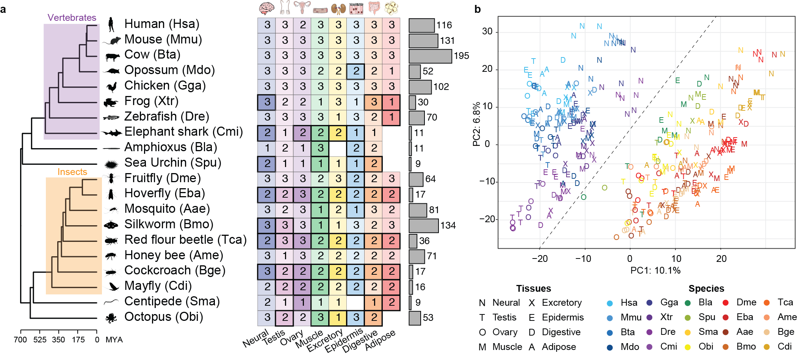
  <figcaption>   <b>Fig. 1: Dataset overview and global patterns of gene expression across bilaterian tissues. a. </b> RNA-seq dataset overview. Left: phylogenetic tree including the common names and scientific acronyms of the 20 bilaterian species considered in this study. Evolutionary distances were derived from 75 (MYA: million years ago) and animal silhouettes downloaded from http://phylopic.org/ (see Acknowledgements for credits to Phylopic icons). Center: scheme of RNA-seq meta-samples. The number of meta-samples for each species (rows) and tissue (columns) is reported. The cell color corresponds to the tissue, while its intensity distinguishes between cases where at least one RNA-seq sample has been generated for this project (full color) from cases where all the included samples are publicly available (transparent color). Right: barplot with the total number of processed RNA sequencing (RNA-seq) samples per species. <b>b.</b> Coordinates of the first (PC1; x axis) and second (PC2; y axis) principal components from a principal component analysis (PCA) performed on normalized gene expression values of best-ancestral, bilaterian-conserved orthogroups across all species’ meta-samples (see Methods). Only the 2,436 best-ancestral orthogroups conserved in all species were considered. Tissue identity is represented by letters and species by colors. The percentage of variance explained by each PC is reported on the relative axis.</figcaption>
<figure>

 

#### Figure 2  

<figure>
  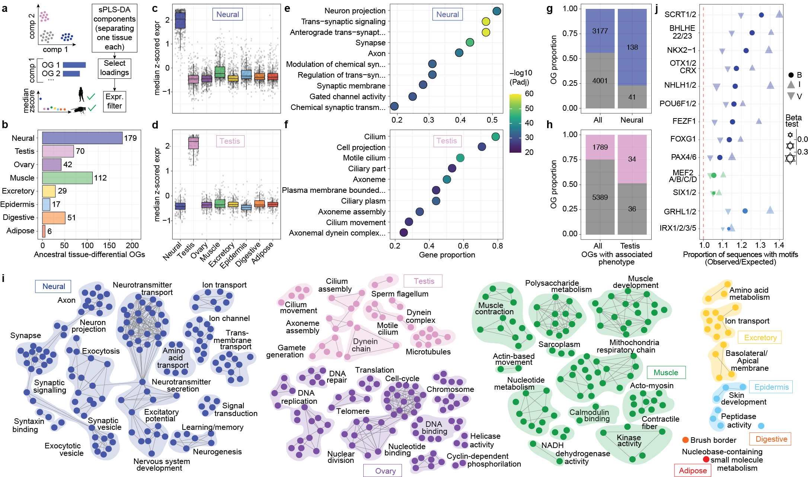
  <figcaption>   <b>Fig. 2: Reconstruction of ancestral bilaterian tissue-specific expression modules. a.</b> Scheme depicting the procedure for the definition of the ancestral tissue-specific modules. We performed a sparse partial least square discriminant analysis (sPLS-DA) on the expression of the best-ancestral orthogroups, where each component specifically separated the meta-samples of one tissue group from all the others. We selected loadings of each component, which corresponded to orthogroups with the most distinctive expression profile in the isolated tissue compared to the rest. Finally, we required these orthogroups to show the highest median expression (after z-scoring expression within each species) in that particular tissue among both vertebrates and insects. <b>b.</b> Number of best-ancestral orthogroups (OGs) included in each ancestral tissue-specific module. <b>c,d.</b> Expression profiles across tissues of best-ancestral orthogroups in the ancestral neural- (c) and testis- (d) specific modules. Expression values were first z-scored by species, and each dot represents the median expression among vertebrates, insects or outgroups. <b>e,f.</b> Top 20 most significantly enriched GO categories in the ancestral neural- (e) and testis- (f) specific modules. Only GOs containing at least 5 orthogroups in the tested set were considered. <b>g,h</b>: Proportion of all bilaterian-conserved orthogroups (left) and ancestral neural- (g) or testis-specific (h) modules (right) associated with experimentally validated phenotypes (in the respective tissue) in mammals and/or fruit fly. <b>i.</b> Representation of GO networks of significantly enriched categories for all ancestral tissue-specific modules, where only categories containing at least 5 orthogroups in the tested set were considered (see Methods). Each node represents a GO category. <b>j.</b> TFs included within each tissue-specific module whose known binding motifs are significantly over-represented in the regulatory regions of the genes in the corresponding module (see Methods). Each TF was tested (Fisher's exact and regression tests) on all sequences (B: bilaterian), only vertebrate (V) or only insect (I) sequences within the module. TFs in each tissue are ordered by the ratio of the proportion of sequences with at least one predicted binding site in the tested module (observed) compared to the proportion in all other bilaterian-conserved genes (expected). The size of each dot reflects the beta from the regression test in the corresponding group, and tissue colors refer to panel b.</figcaption>
<figure>

 

#### Figure 3  

<figure>
  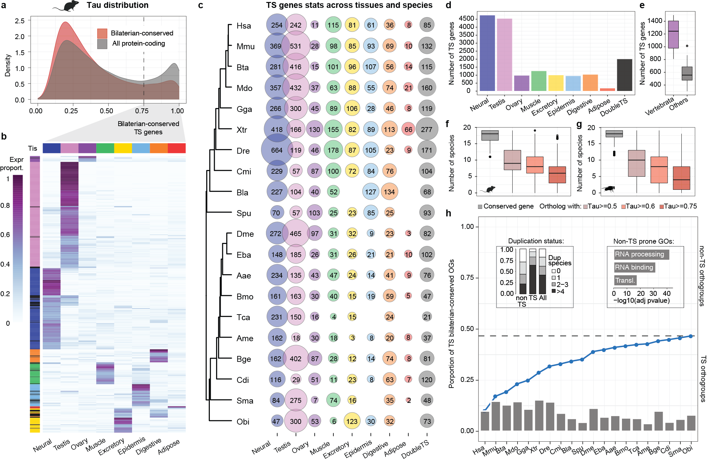
  <figcaption>   <b>Fig. 3: Tissue-specificity patterns across species reveal low conservation of tissue-specific expression profiles. a.</b> Tau distributions of all (gray) or bilaterian-conserved (red) mouse protein-coding genes passing the expression cutoff. <b>b.</b> Heatmap showing the clustering of mouse bilaterian-conserved, tissue-specific genes (rows) based on their expression proportion (tissue_expr / all_tissue_expr) across tissues (columns). The heatmap was generated by pheatmap in R with default parameters, and the complete dendrogram is shown in Supplementary Fig. 3. Black indicates double-tissue-specificity. <b>c,d.</b> Number of bilaterian-conserved, tissue-specific genes across all species (rows) and tissues (columns) (c) and collapsed by tissue (d). <b>e.</b> Distribution of the number of bilaterian-conserved, tissue-specific genes in vertebrates versus all other species (p-value = 2e-04, Wilcoxon rank sum test). <b>f,g.</b> Distribution of the number of species in which mouse (f) or fruit fly (g) bilaterian-conserved, tissue-specific genes have at least one ortholog (gray) and this ortholog(s) has a Tau value higher than a specific cutoff (0.5, 0.6 and 0.75; other shades). <b>h.</b> Barplot: proportion of bilaterian-conserved orthogroups including at least one tissue-specific gene in each given species. Line plot: cumulative distribution of the proportion of unique bilaterian-conserved orthogroups containing at least one tissue-specific gene across species. NB: All genes included in the bilaterian-conserved orthogroups were considered for this analysis. The dashed line marks the total proportion. The two boxes include information on the duplication status of the non-tissue-specific (non-TS) and tissue-specific (TS) orthogroups (left) and the top GO enrichments for the non-TS orthogroups (right).</figcaption>
<figure>

 

#### Figure 4  

<figure>
  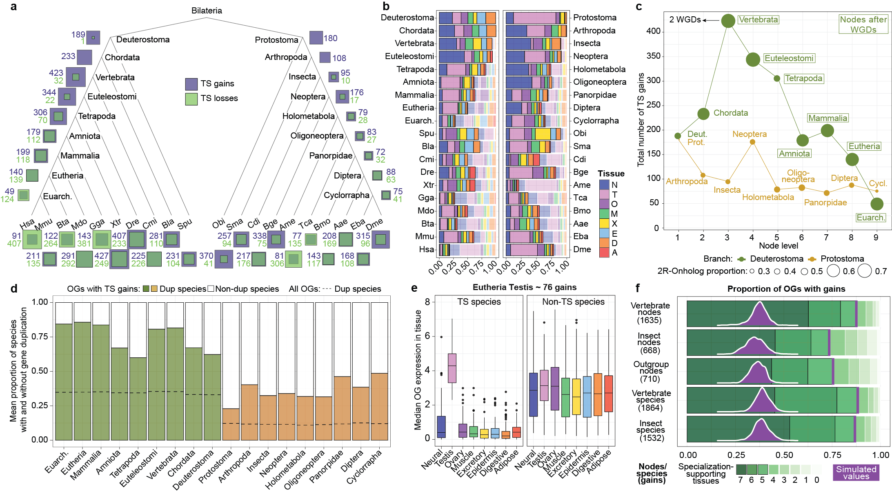
  <figcaption>   <b>Fig. 4: Tissue-specificity gains are associated with gene duplication and specialization. a.</b> Total numbers of tissue-specificity gains and losses across all nodes and species. <b>b.</b> Relative proportions of tissue-specificity gains and losses across tissues within each node and species. Full/transparent shades of tissue colors represent gains/losses, respectively. <b>c.</b> Total number of tissue-specificity gains across nodes on each phylogenetic branch. The size of the dots represents the proportion of orthogroups including 2R-onhologs (i.e., paralogs originated by the two rounds of vertebrate WGDs) in each gain group. <b>d.</b> Average proportions of duplicated and non-duplicated species among the species with tissue-specific expression in the orthogroups that gain tissue-specificity in each node. The background line represents the expected proportion based on all bilaterian-conserved orthogroups for the same sets of species (i.e., descendant species for that node). <b>e.</b> Median gene expression across tissues for bilaterian-conserved, best-TS orthogroups with testis-specific gains in Eutheria (76 orthogroups) for the species with (left; 3 eutherian species) or without (right; 17 non-eutherian species) inferred tissue-specificity. <b>f.</b> For each set of tissue-specificity gains, distribution of the number of tissues (in which the gene is not tissue-specific) where the median expression of the species without tissue-specificity is higher than in the set of species with tissue-specificity (from 0 to 7, “specialization-supporting tissues''). The purple distribution represents the proportion of gains with specialization-supporting tissues ≥ 5 coming from 100 randomizations of the tissue-specificity labels within the respective best-TS orthogroups (see Extended Data Fig. 8d,e for full data). Abbreviations: N: neural, T: testis, O: ovary, M: muscle, X: excretory system, E: epidermis, D: digestive tract, A: adipose, Euarch: Euarchontoglires. Cycl: Cyclorrapha. Deut: Deuterostoma. Prot: Protostoma.</figcaption>
<figure>

 

#### Figure 5  

<figure>
  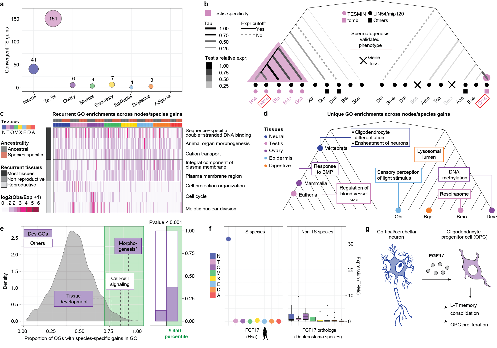
  <figcaption>  <b>Fig. 5: Tissue-specific gains are associated with the emergence of unique phenotypes. a.</b> Number of convergent tissue-specificity gains (on the deuterostome and protostome branches) in each tissue. <b>b.</b> Example of a convergent testis-specific gain: TESMIN/tomb. <b>c.</b> Heatmap representing GO categories either (i) significantly enriched in the gains of at least 15 nodes/species across all tissues (most/non reproductive labels) or (ii) significantly enriched in the gains of at least 8 nodes/species in one tissue exclusively (reproductive label, which indicates ovary and testis combined). The plotted values (log2(observed/expected+1)) were computed starting from the proportion of gains in each node/species belonging to the tested category (observed) and the proportion of all bilaterian-conserved orthogroups with a functional annotation belonging to the same category (expected). <b>d.</b> Examples of GO categories significantly enriched exclusively among the gains of one node/species. <b>e.</b> Left: Distribution of the proportion of orthogroups in each GO category with at least one tissue-specific, species-specific gain. The green area represents categories in the 95th percentile or above. Only GO categories including at least ten bilaterian-conserved orthogroups are shown. Right: Proportions of GO terms below or above the 95th percentile representing developmental functions. The reported p-value is computed out of the proportions of developmental functions in the 95th percentile coming from 1000 randomizations of the GO labels (Extended Data Fig. 9c). Morphogenesis* stands for “anatomical structure formation involved in morphogenesis”. See Methods for definition of developmental categories. <b>f.</b> Expression across tissues for human FGF17 (left) and its deuterostome orthologs (right). <b>g.</b> Schematic summary of FGF17's function in the brain (based on 42). Abbreviations: N: neural, T: testis, O: ovary, M: muscle, X: excretory system, E: epidermis, D: digestive tract, A: adipose, BMP: bone morphogenic protein, TS: tissue-specific, L-T: long-term.</figcaption>
<figure>

 

### Extended Data Figures  

#### Extended Data Figure 1  

<figure>
  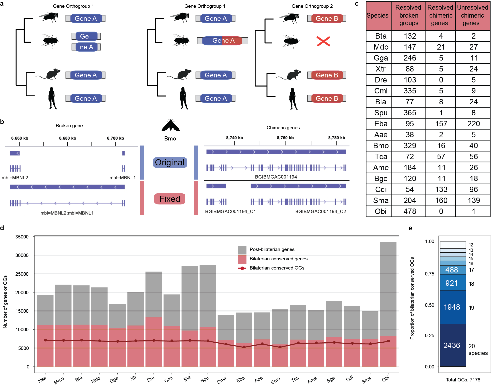
  <figcaption>   <b>Extended Data Fig. 1: a.</b> Schematic representation of broken (left) and chimeric (right) genes and how they potentially influence gene orthology inferences. <b>b.</b> Examples of a broken (left) and chimeric (right) genes corrected in the silkworm gene annotation. <b>c.</b> Statistics of corrected and unresolved broken and chimeric genes across all species. <b>d.</b> Barplot representing the number of bilaterian-conserved (red) or more recent (gray) protein-coding genes across all species. The line plot represents the number of bilaterian-conserved orthogroups (OGs; i.e., orthogroups conserved in at least 12 species) in which genes from each species are represented. <b>e.</b> Proportions of bilaterian-conserved orthogroups based on the number of species in which they are conserved.</figcaption>
<figure>

 

#### Extended Data Figure 2  

<figure>
  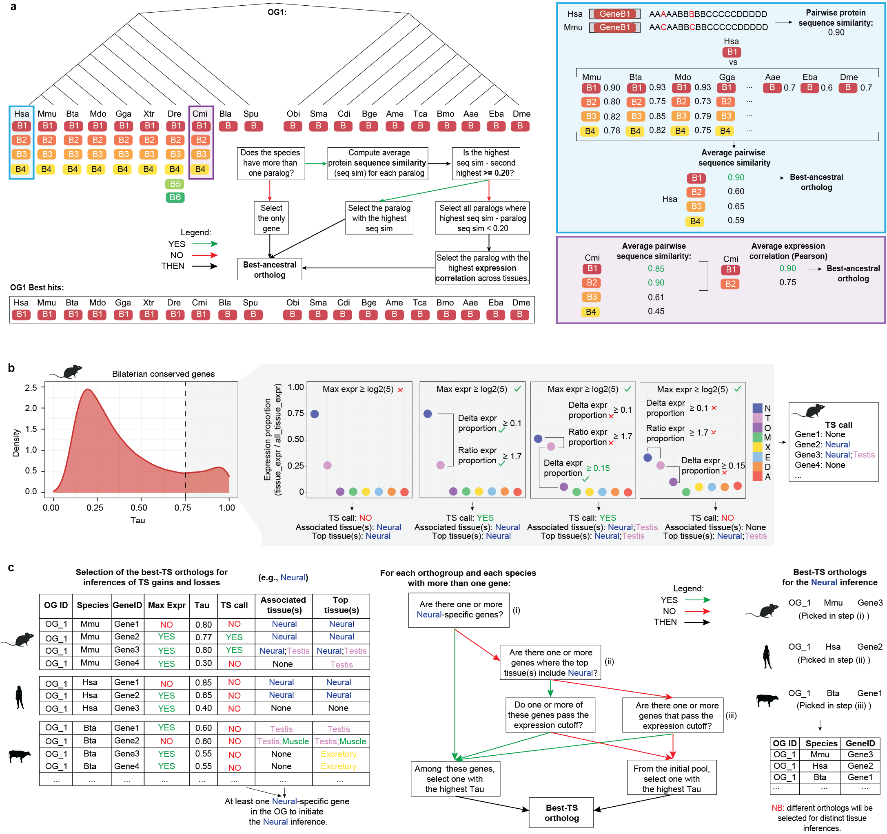
  <figcaption>   <b>Extended Data Fig. 2: a.</b> Schematic and relative example for the selection of bilaterian-conserved, best-ancestral orthologs in each species (see Methods). <b>b.</b> Schematic of the procedure adopted to associate all tissue-specific genes in each species (Tau ≥ 0.75) with the tissue(s) with tissue-specificity. This association (which we also evaluated for non-tissue-specific genes) will be considered for the inference of tissue-specificity gains (Extended Data Fig. 5). Additionally, we identified the top tissue(s) (i.e., the tissue(s) with the highest expression) for all bilaterian-conserved genes, which will be considered for the selection of the best-TS orthogroups and the inference of tissue-specificity losses in each tissue (panel c and Extended Data Fig. 5c, respectively). <b>c.</b> Schematic and relative example for the selection of the best-TS ortholog in each species (see Methods).</figcaption>
<figure>  

 

#### Extended Data Figure 3   

<figure>
  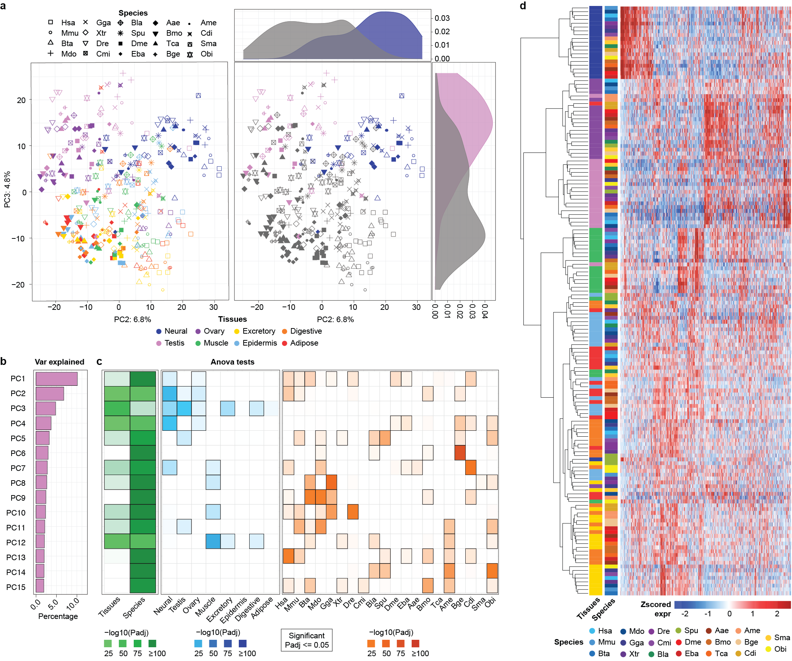
  <figcaption>   <b>Extended Data Fig. 3: a.</b> Coordinates of the second (PC2; x axis) and third (PC3; y axis) components of a PCA performed on normalized gene expression values across meta-samples of best-ancestral orthogroups. Only the 2,436 best-ancestral orthogroups conserved in all species were considered. Tissue identity is represented by colors and species by shape. The left panel shows all tissues, while the right panel highlights neural and testis samples compared to all others. Coordinate distributions of these three groups of meta-samples are shown on the side of the relative component. The percentage of variance explained by each PC is reported on the relative axis. <b>b.</b> Percentage of variance explained by the first 15 principal components from the PCA described in b. <b>c.</b> -log10(p-value) of ANOVA tests performed among the coordinates of the specified groups on each component. For the left panel (green) we tested if there was a significant difference between tissues or species groups. For the center and right panel (blue and orange) we tested if there was a significant difference between any query group (i.e., column) versus all other collapsed groups. All tests were performed with the aov function in R, and p-values were Bonferroni corrected. <b>d.</b> Heatmap showing the clustering of tissues and species (rows) based on the averaged expression across tissues of best-ancestral bilaterian-conserved orthogroups (columns). Expression values were z-scored across tissues of the same species in order to minimize the inter-species variability. Only the 2,436 best-ancestral orthogroups conserved in all species were considered. The heatmap was generated by the pheatmap function in R with ward.D2 clustering method. Tissue colors refer to panel b.</figcaption>
<figure>

 

#### Extended Data Figure 4   

<figure>
  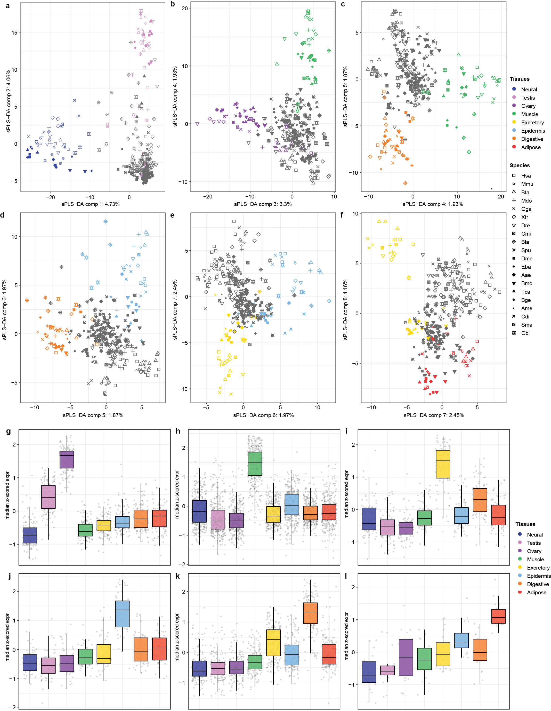
  <figcaption>   <b>Extended Data Fig. 4: a-f.</b> Coordinates of components returned by a sparse partial least square discriminant analysis (sPLS-DA) run separating the meta-samples of each tissue group (depicted with the relative colors) from all the others (gray). All 7,178 best-ancestral orthogroups were considered. The loadings of these components will be used to define the ancestral bilaterian tissue-specific modules (see Fig. 2a,b). <b>g-l:</b> Expression profiles across tissues of best-ancestral orthogroups in the ancestral tissue-specific modules (see Fig. 2c,d for neural and testis modules). Expression values were first z-scored by species, and each dot represents the median expression among vertebrates, insects or outgroups.</figcaption>
<figure>

 

#### Extended Data Figure 5   

<figure>
  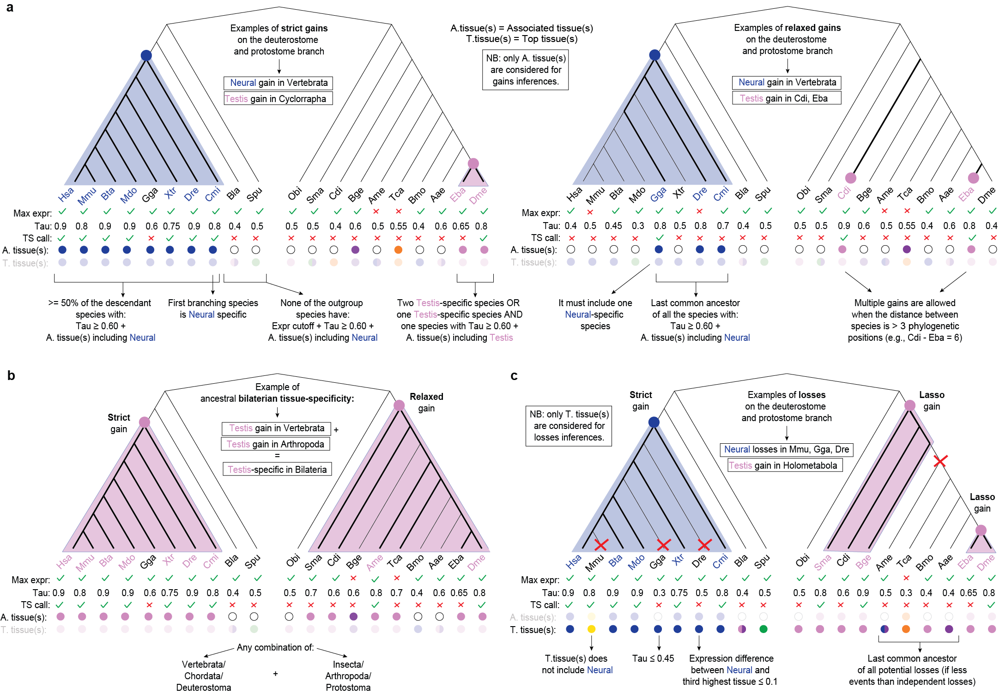
  <figcaption>   <b>Extended Data Fig. 5: a.</b> Examples and criteria for the inference of tissue-specificity gains on either the deuterostome or protostome branches with the strict approach (left panel) and the relaxed approach (right panel). <b>b.</b> Example and criteria for the inference of ancestral bilaterian tissue-specificity. <b>c.</b> Examples and criteria for the inference of tissue-specificity losses. NB: the best-TS orthogroups are the ones considered for all inferences of tissue-specificity gains and losses (see Methods and Extended Data Fig. 2b,c).</figcaption>
<figure>

 

#### Extended Data Figure 6   

<figure>
  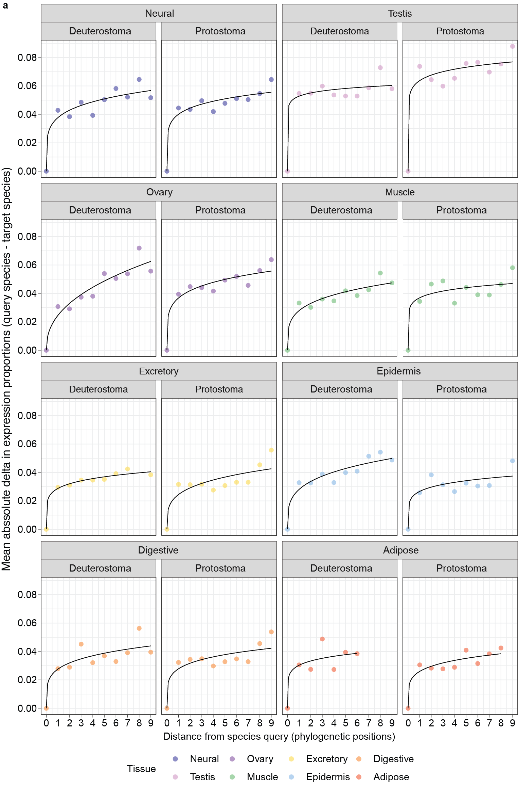
  <figcaption>   <b>Extended Data Fig. 6: a.</b> Expression divergence of the query species on each phylogenetic branch (Hsa for the deuterostomes, Dme for the protostomes) from all other species on the same branch in function of the number of phylogenetic positions that separate them (e.g., 1 corresponds to Mmu/Eba, 2 to Bta/Aae, etc). Expression divergence in each tissue is represented by the absolute deltas of expression proportions between the two compared species, averaged among all best-ancestral orthogroups. The nonlinear regression with formula y = axk was fitted as in <a href="https://genome.cshlp.org/content/29/1/53">Chen at al, Genome Research, 2019</a>.</figcaption>
<figure>

 

#### Extended Data Figure 7   

<figure>
  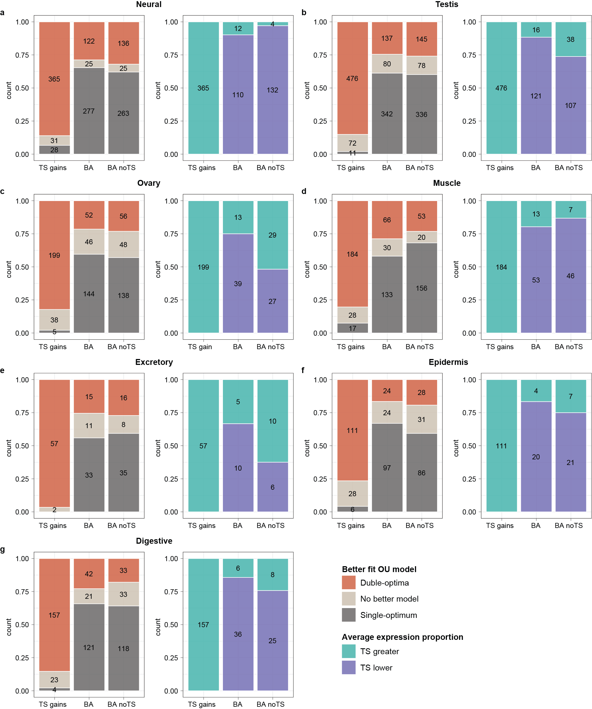
  <figcaption>   <b>Extended Data Fig. 7: a-g.</b> Orthogonal validation of all the inferred tissue-specificity gains in each tissue for which we could implement an OUs comparison method (see Methods and Supplementary Discussion). The first bar always corresponds to the selected tissue-specificity gains (TS gains), while the second and third bars represent control sets (of the same size as the test set) sampled from either all best-ancestral orthogroups (BA) or best-ancestral orthogroups without tissue-specificity gains (BA no TS), to which we randomly assigned the tissue-specificity labels of the corresponding test set (see Methods). Left barplot: proportions of orthogroups based on the OU model (either a double-optima or a single-optimum) that better fits the relative expression levels. The double-optima OU model postulates different expression optima for the species with and without tissue-specificity, where the latter also include all species with losses. Right barplot: proportions of orthogroups better fitting a double-optima OU model (in red on the left barplot) depending on whether the species with tissue-specificity show higher/lower average relative expression compared to species without (TS greater/lower, respectively).</figcaption>
<figure>

 

#### Extended Data Figure 8   

<figure>
  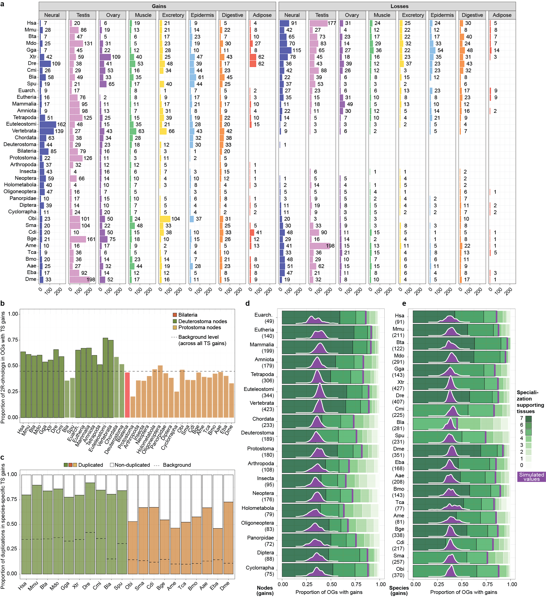
  <figcaption>   <b>Extended Data Fig. 8: a.</b> Barplots representing the number of inferred tissue-specificity gains (left) and losses (right) across all nodes/species (rows) and tissues (columns). Best-TS, bilaterian-conserved orthogroups were the ones considered for these inferences. <b>b.</b> Proportion of tissue-specificity gains in each node/species occurring in best-TS orthogroups that include 2R-onhologs. Deuterostome nodes/species are distinguished between those diverging before (transparent color) or after (full color) the two rounds of vertebrate WGDs. The black line represents the proportion of 2R-onhologs across all tissue-specificity gains. <b>c.</b> Proportions of duplicated (i.e., with at least one paralog) or non-duplicated (i.e., single-copy) genes with tissue-specific, species-specific gains in all species. The background line represents the overall proportion of duplicated genes in each species. <b>d,e.</b> Same data represented in Fig. 5f, but plotted separately across all nodes (d) and species (e). NB: Bilaterian “gains” indicate ancestral bilaterian tissue-specificity, which might have been acquired either in the last bilaterian ancestor or previously in evolution. Abbreviations: Euarch: Euarchontoglires.</figcaption>
<figure>

 

#### Extended Data Figure 9   

<figure>
  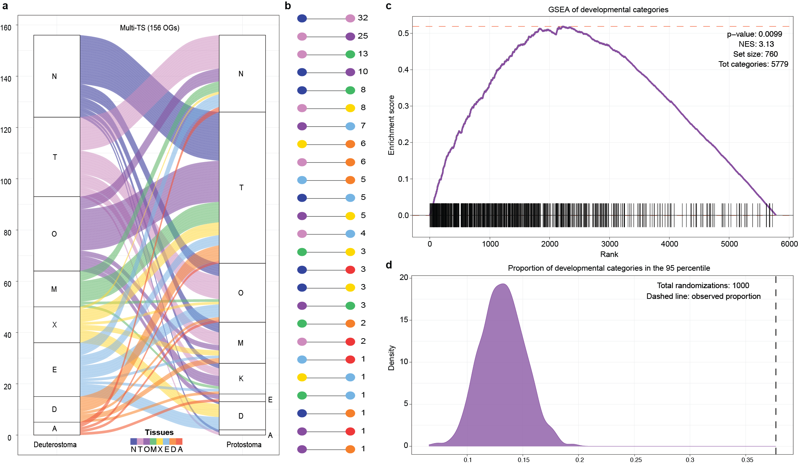
  <figcaption>   <b>Extended Data Fig. 9: a.</b> Alluvia plot representing the best-TS, bilaterian-conserved orthogroups with tissue-specificity gains in distinct tissues between deuterostome (left) or protostome (right) nodes and species. Only orthogroups with gains in exclusively one tissue on each branch were considered. <b>b.</b> Number of parallel tissue-specificity gains between the deuterostome and protostome branch for all pairs of tissues represented in panel a. <b>c.</b> Plot from a Gene Set Enrichment Analysis (GSEA) testing for over-representation of developmental categories (760 out of 5779) among categories with high proportions of orthogroups that undergo species-specific gains of tissue-specificity. Only categories including at least 10 gene orthogroups were considered. <b>d.</b> Proportions of developmental GO categories among the top 5% (i.e. 95th percentile) of all GO categories ranked based on the proportions of their annotated orthogroups that undergo species-specific gains. The plotted values derive from 1000 randomization of the developmental labels among all GO categories, with the vertical dashed line corresponding to the observed proportion.</figcaption>
<figure>

 

#### Extended Data Figure 10   

<figure>
  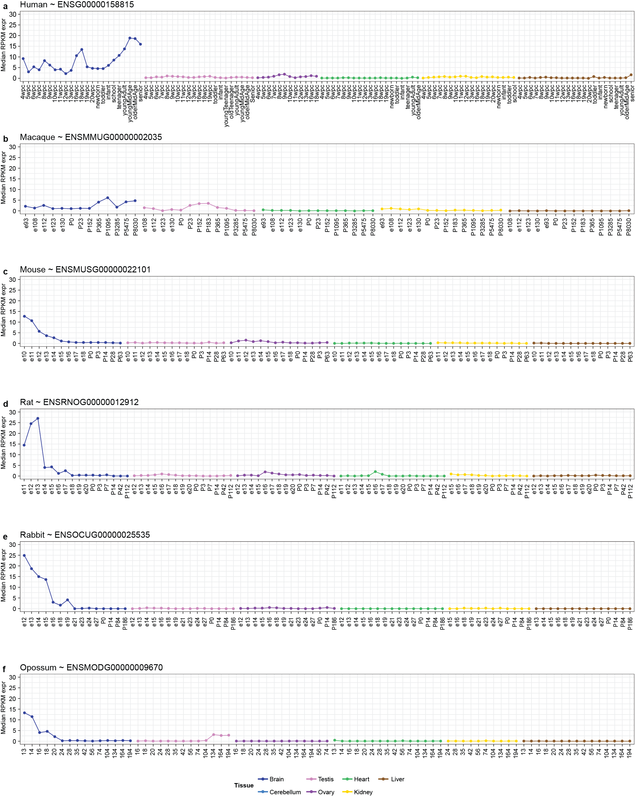
  <figcaption>   <b>Extended Data Fig. 10: a-f:</b> Expression values (RPKMs) for human FGF17 (a) and its orthologs in five mammalian species (b-f) across several developmental and adult timepoints in seven tissues. Data from <a href="https://www.nature.com/articles/s41586-019-1338-5">Cardoso et al, Nature, 2019</a>.</figcaption>
<figure>

 

### Supplementary Figures    

#### Supplementary Figure 1  

<figure>
  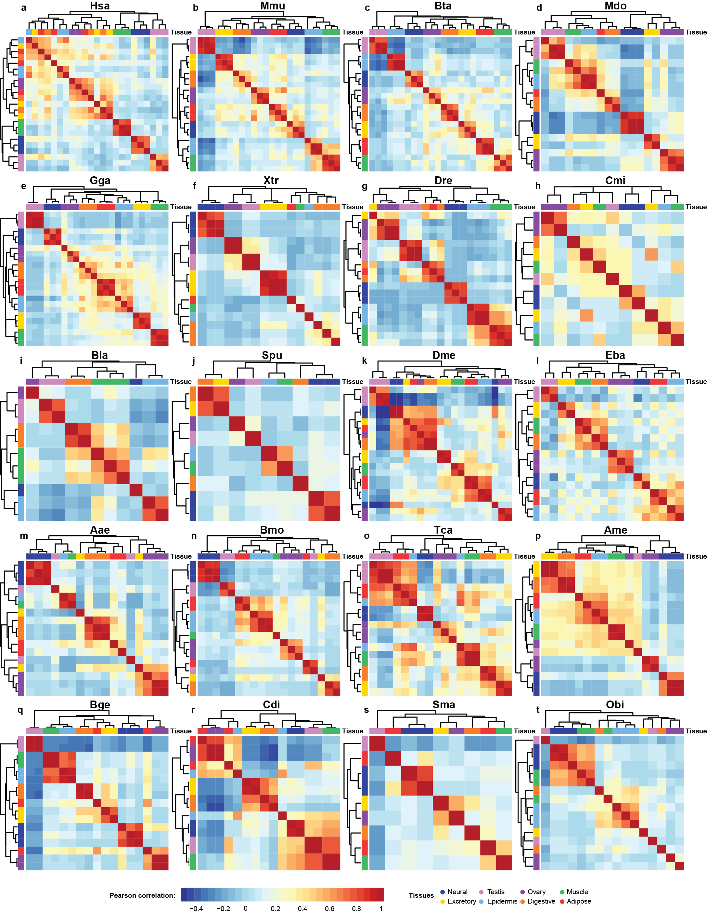
  <figcaption>   <b>Supplementary Fig. 1: a-t.</b> Clustering of each species’ meta-samples based on their expression correlation. Expression correlation is represented by Pearson coefficient computed on log2(TPM+1) meta-sample expression values (see Methods), where only the 2,500 genes with the highest coefficient of variation were considered in each species. The heatmaps were generated by the pheatmap function in R with default clustering parameters.</figcaption>
<figure>

 

#### Supplementary Figure 2  

<figure>
  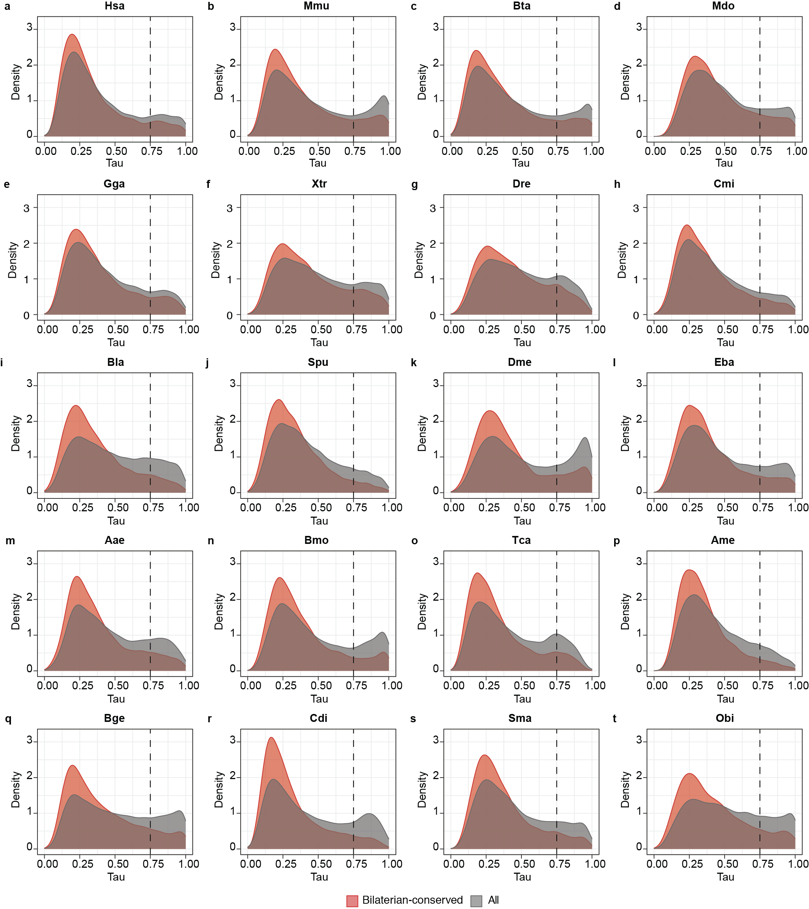
  <figcaption>   <b>Supplementary Fig. 2: a-t.</b> Tau distributions of bilaterian-conserved (red) or all (gray) protein-coding genes in each species passing the expression cutoff. Dashed line marks the selected cutoff for tissue-specificity (Tau=0.75).</figcaption>
<figure>

 

#### Supplementary Figure 3  

<figure>
  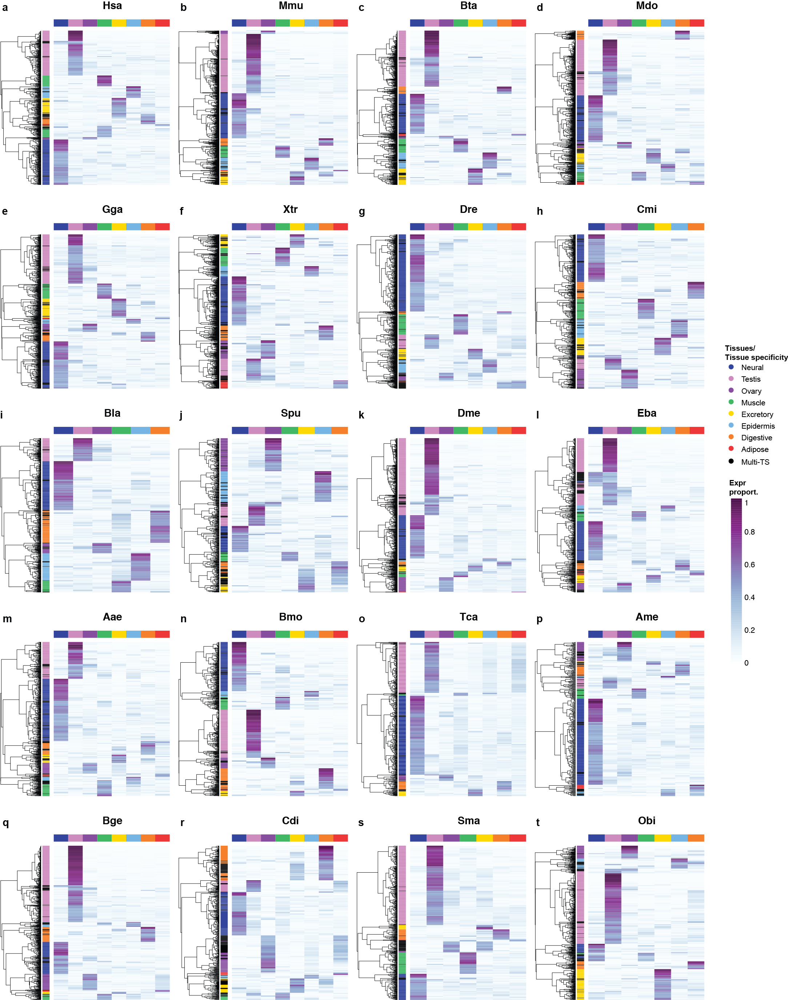
  <figcaption>   <b>Supplementary Fig. 3: a-t.</b> Heatmaps showing the clustering of bilaterian-conserved, tissue-specific genes (rows) based on their expression proportion (tissue_expr / all_tissue_expr) across tissues (columns) in each species. The heatmaps were generated by the pheatmap function in R with default clustering parameters.
  </figcaption>
<figure>

 

#### Supplementary Figure 4  

<figure>
  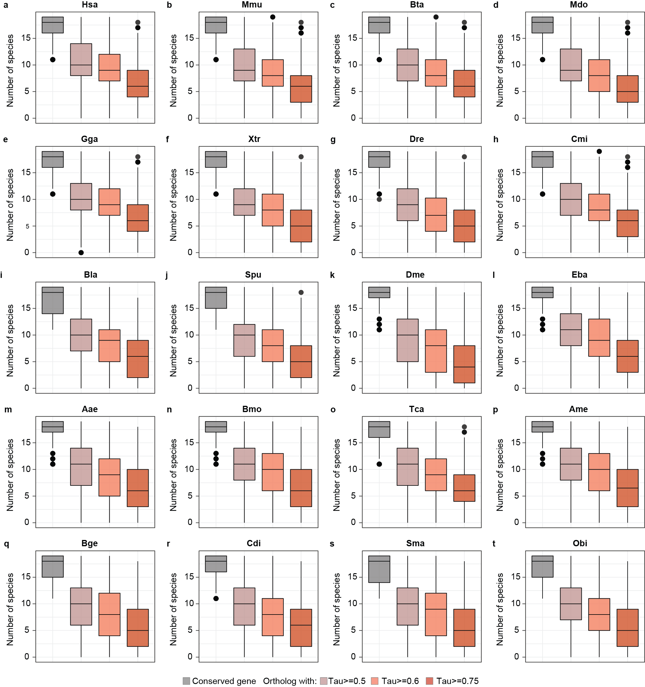
  <figcaption>   <b>Supplementary Fig. 4: a-t.</b> Distribution of the number of species in which each species’ bilaterian-conserved, tissue-specific genes have at least one ortholog (gray) and this ortholog(s) has a Tau value higher than the specific cutoff (0.5, 0.6 and 0.75; other shades). The complete bilaterian-conserved orthogroups were considered in this analysis.</figcaption>
<figure>